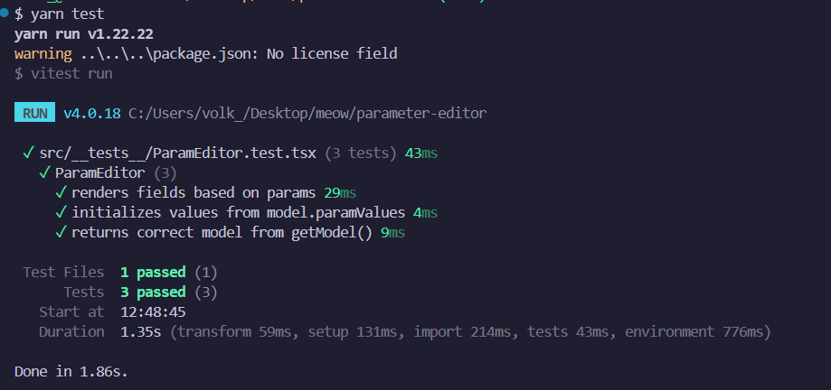

# ParamEditor Test Task

## Установка
yarn

## Запуск проекта
yarn dev

## Запуск тестов
yarn test

## Используемые технологии
- React + TypeScript
- Vitest
- React Testing Library

## Проверяемое поведение
- Все параметры отображаются по `params`
- Значения инициализируются из `model.paramValues`
- `getModel()` возвращает корректную структуру Model

## Пример вывода тестов
